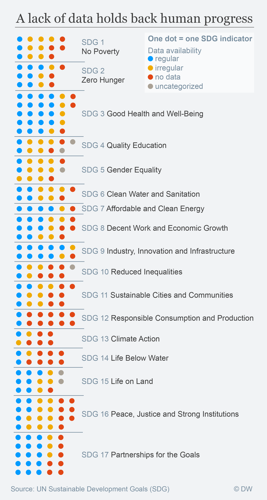
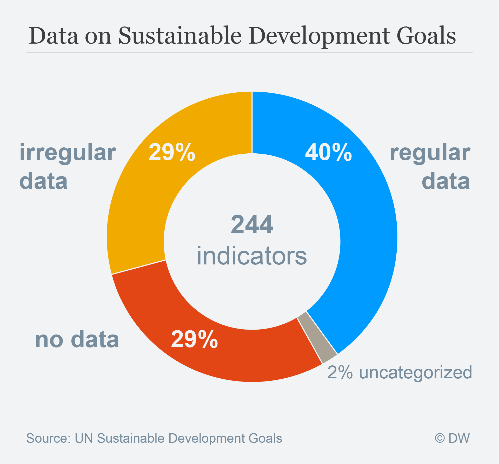

# How is the data availability to measure progress of Sustainable development goals?

Why you should care about this, you can read [here](http://p.dw.com/p/2uBtU). Idea, data collection and analysis by [Ajit Niranjan](https://twitter.com/NiranjanAjit).

**Data source**:[UN Stats](https://unstats.un.org/sdgs/iaeg-sdgs/tier-classification/)

**Analysis**:[Please refer to the Jupyter Notebook](SustainableDevelopmentGoals_Data-availability.ipynb)

